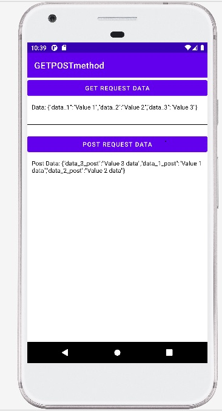

# GET_POST_RESTapi
Shows how to get and post json data.
Given example shows how to get and post json data.
Follow the steps:
1. Open XAMPP server and start the apache module.
2. In notepadd++, create two .php file. one for get data and another for post data.
3. Save it in local disk in xampp/htdocs/new_folder_name/
4. Open command prompt and type "ipconfig" to get IPAddress of your system.
5. Put the ipaddress and desired path of your getdata file in Search bar to check whether data is seen or not.
6. Copy the link and use as string URL in your android application. 
Thank you. 
Screenshot:

